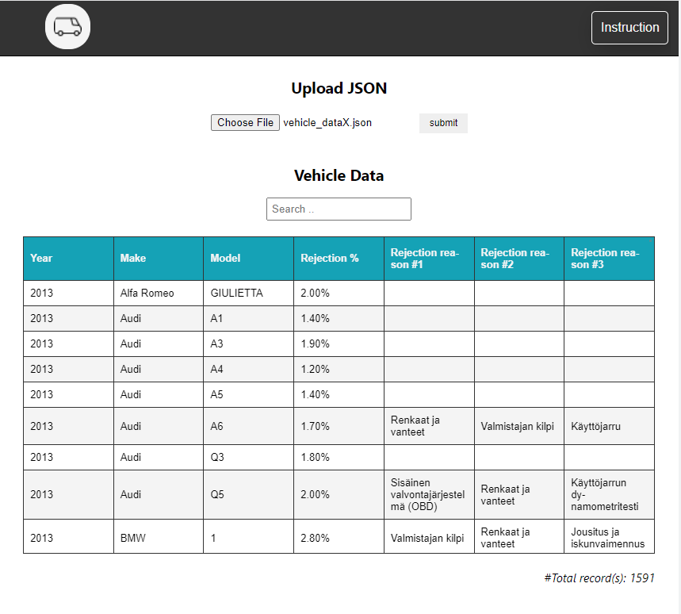
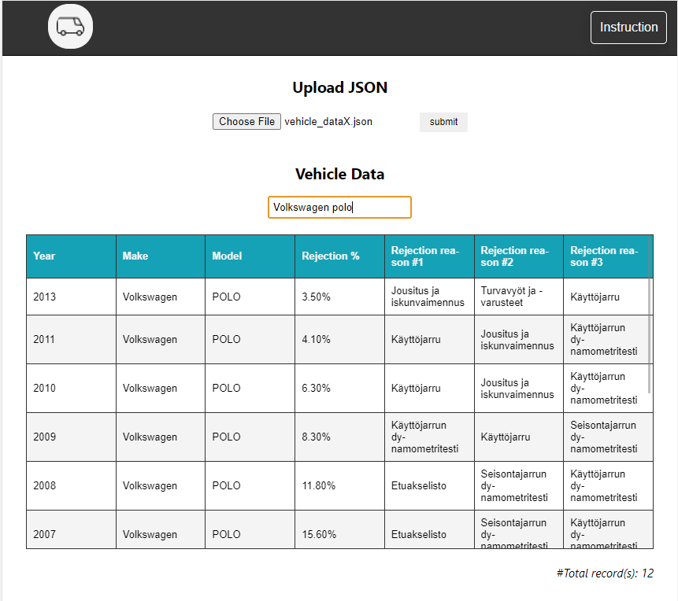

## VEHICLE DATABASE

### Description
User uploads [JSON file type](./utils/vehicle_data.json) to database and filter the database by using search bar

### Layout



### Backend

- NodeJS, ExpressJS
- Postgres and Sequelize
- Full-text search

### Frontend
- Vanilla JS

### Setup
> create .env in the root with the contain as following
```
    DB_PASSWORD=<your-db-password>
    DB_USERNAME=<your-db-name>
    DB_HOST=127.0.0.1

```
> install dependencies
```
    npm install
```
> run web app
```
    npm run dev
```
